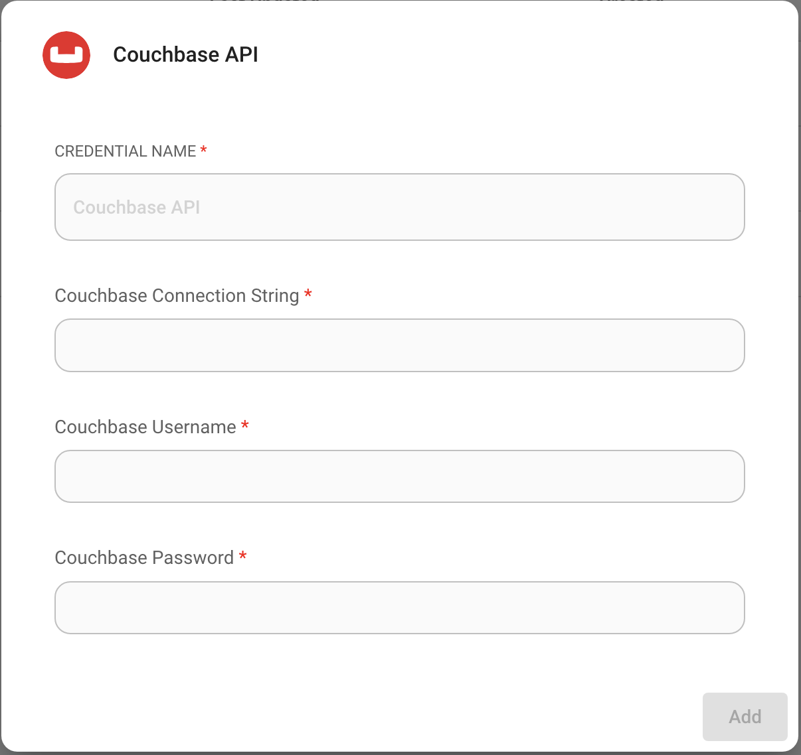
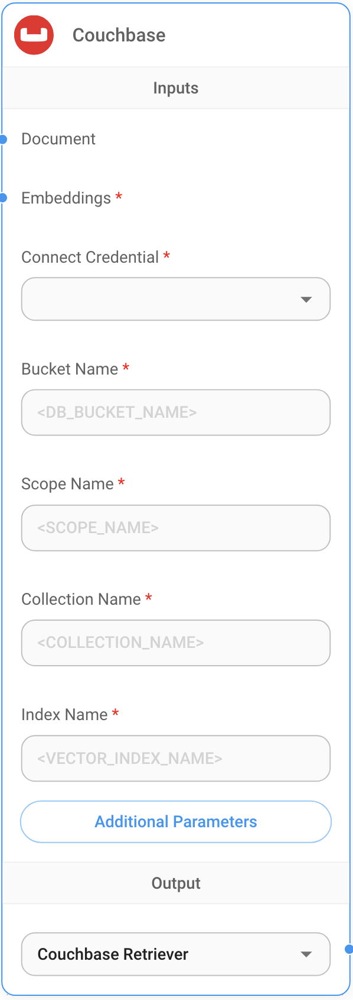
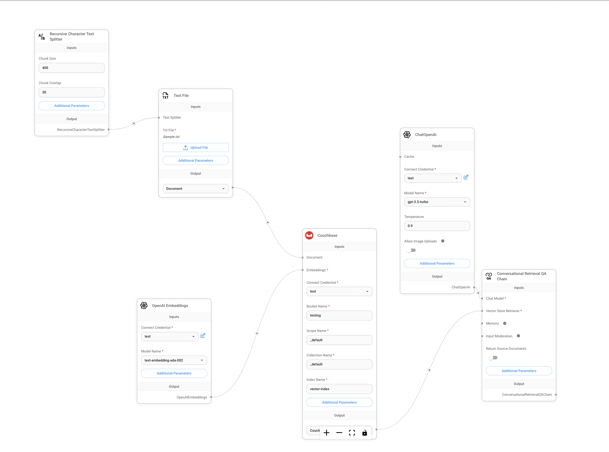
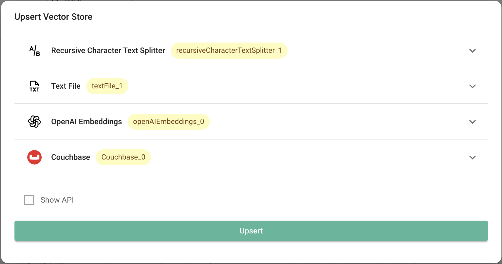
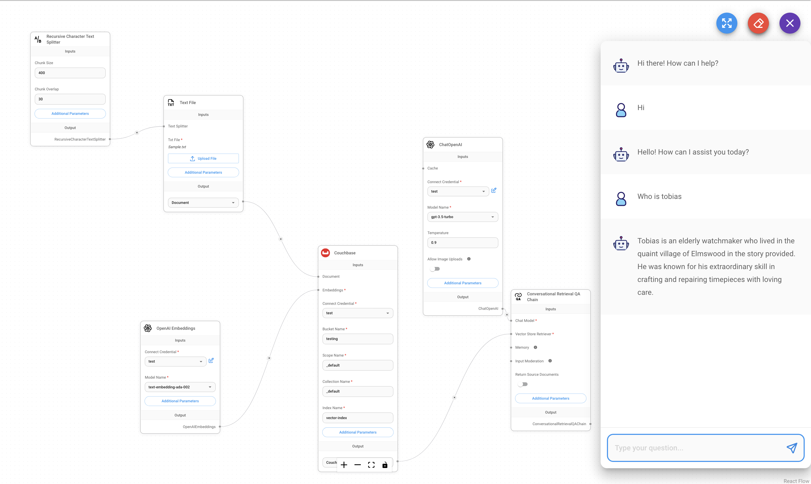

# Couchbase

## Prerequisites

- Couchbase Cluster (Self Managed or Capella) version 7.6+  with [Search Service](https://docs.couchbase.com/server/current/fts/fts-introduction.html)


### Setup Database Configuration

#### Capella Setup

To know more about connecting to your Capella cluster, please follow the [instructions](https://docs.couchbase.com/cloud/get-started/connect.html).

Specifically, you need to do the following:

- Create the [database credentials](https://docs.couchbase.com/cloud/clusters/manage-database-users.html) to access cluster via SDK
- [Allow access](https://docs.couchbase.com/cloud/clusters/allow-ip-address.html) to the Cluster from the IP on which the application is running.

#### Self Managed Setup

- Follow [Couchbase Installation Options](/tutorial-couchbase-installation-options) for installing the latest Couchbase Database Server Instance. Make sure to add the [Search Service](https://docs.couchbase.com/server/current/fts/fts-introduction.html)


### Create the Search Index on Full Text Service

We need to create the Search Index on the Full Text Service in Couchbase. For example, you can import the following index using the instructions.

- [Couchbase Capella](https://docs.couchbase.com/cloud/search/import-search-index.html)

  - Copy the index definition to a new file index.json
  - Import the file in Capella using the instructions in the documentation.
  - Click on Create Index to create the index.

- [Couchbase Server](https://docs.couchbase.com/server/current/search/import-search-index.html)

  - Click on Search -> Add Index -> Import
  - Copy the following Index definition in the Import screen
  - Click on Create Index to create the index.

You may also create a vector index using Search UI on both [Couchbase Capella](https://docs.couchbase.com/cloud/vector-search/create-vector-search-index-ui.html) and [Couchbase Self Managed Server](https://docs.couchbase.com/server/current/vector-search/create-vector-search-index-ui.html)


#### Index Definition

Here, we are creating the index `vector-index` on the documents. We are defining an index on the `testing` bucket's `_default` scope on the `_default` collection with the vector field set to `embedding` with 1536 dimensions and the text field set to `text`. We are also indexing and storing all the fields under `metadata` in the document as a dynamic mapping to account for varying document structures. The similarity metric is set to `dot_product`. If there is a change in these parameters, please adapt the index accordingly.

```json
{
  "name": "vector-index",
  "type": "fulltext-index",
  "params": {
    "doc_config": {
      "docid_prefix_delim": "",
      "docid_regexp": "",
      "mode": "type_field",
      "type_field": "type"
    },
    "mapping": {
      "default_analyzer": "standard",
      "default_datetime_parser": "dateTimeOptional",
      "default_field": "_all",
      "default_mapping": {
        "dynamic": true,
        "enabled": true,
        "properties": {
          "metadata": {
            "dynamic": true,
            "enabled": true
          },
          "embedding": {
            "enabled": true,
            "dynamic": false,
            "fields": [
              {
                "dims": 1536,
                "index": true,
                "name": "embedding",
                "similarity": "dot_product",
                "type": "vector",
                "vector_index_optimized_for": "recall"
              }
            ]
          },
          "text": {
            "enabled": true,
            "dynamic": false,
            "fields": [
              {
                "index": true,
                "name": "text",
                "store": true,
                "type": "text"
              }
            ]
          }
        }
      },
      "default_type": "_default",
      "docvalues_dynamic": false,
      "index_dynamic": true,
      "store_dynamic": true,
      "type_field": "_type"
    },
    "store": {
      "indexType": "scorch",
      "segmentVersion": 16
    }
  },
  "sourceType": "gocbcore",
  "sourceName": "testing",
  "sourceParams": {},
  "planParams": {
    "maxPartitionsPerPIndex": 103,
    "indexPartitions": 10,
    "numReplicas": 0
  }
}
```

## Setup

1. Add a new **Couchbase** node on canvas.
2. Create new Couchbase credential using the connection string, username, password for the cluster.

<figure><figcaption></figcaption></figure>

4. Enter the required fields into the **Couchbase** node:
   * Select the above created credential from the dropdown
   * Bucket name
   * Scope name
   * Collection name
   * Index name

<figure><figcaption></figcaption></figure>

5. **Document** input can be connected with any node under [**Document Loader**](../document-loaders/) category.
6. **Embeddings** input can be connected with any node under [**Embeddings**](../embeddings/) category.

7. Now you can start upserting data with Couchbase:

<figure><figcaption></figcaption></figure>

<figure><figcaption></figcaption></figure>


8. Start querying!

<figure><figcaption></figcaption></figure>


## Resources

* [Couchbase documentation](https://docs.couchbase.com/home/index.html)
* [LangChain JS Couchbase](https://js.langchain.com/docs/integrations/vectorstores/couchbase)